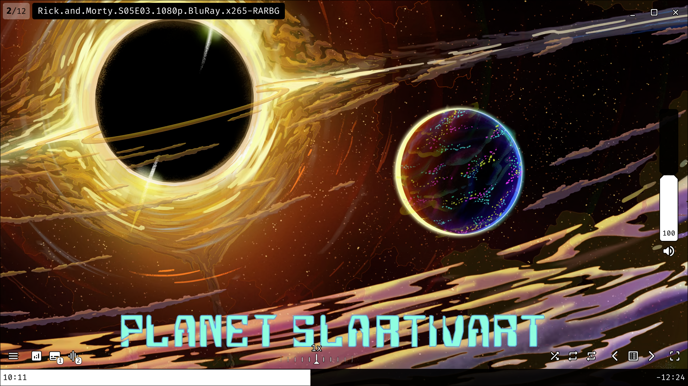
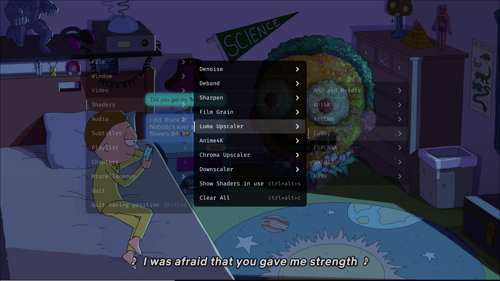
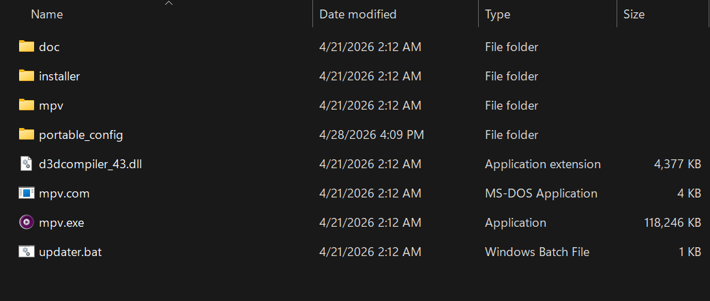

# My Personal MPV Configuration

A personal MPV setup with a customized UI, useful scripts, shader presets, YouTube playback support, and sensible defaults for high-quality playback.





---

## Table of Contents

- [Installation](#installation)
  - [Windows](#windows)
  - [Linux / macOS](#linux--macos)
- [Settings You May Want to Change](#settings-you-may-want-to-change)
- [Important Notes](#important-notes)
- [Included Scripts](#included-scripts)
- [Included Shaders](#included-shaders)
- [References](#references)

---

# Installation

## Windows

### 1. Download MPV

Download the latest 64-bit Windows build of MPV from the Shinchiro builds page:

[Download MPV for Windows](https://github.com/shinchiro/mpv-winbuild-cmake/releases)

Choose one of the following:

- `mpv-x86_64-*.7z` — recommended for most systems
- `mpv-x86_64-v3-*.7z` — recommended for newer CPUs

Extract the archive somewhere permanent.  
This folder will be your main MPV folder, so place it somewhere you will not move or delete later.

---

### 2. Install MPV File Associations

Inside the MPV folder, open the `installer` folder.

Right-click:

```text
mpv-install.bat
```

Then select:

```text
Run as administrator
```

After installation finishes, Windows may prompt you to open Control Panel so you can set MPV as your default media player.

---

### 3. Download This Configuration

Download this repository:

[Download MPV Config](https://github.com/HongYue1/mpv-config/archive/refs/heads/main.zip)

Extract the archive, then copy the `portable_config` folder into your MPV folder.

It should be placed next to:

```text
mpv.exe
```

---

### 4. Updating MPV

To update MPV later, right-click:

```text
updater.bat
```

Then choose:

```text
Run as administrator
```

Follow the instructions in the updater.

The updater also gives you the option to install `yt-dlp`, which allows MPV to stream videos from YouTube and many other supported websites.

Supported sites list:

[yt-dlp supported sites](https://github.com/yt-dlp/yt-dlp/blob/master/supportedsites.md)

After the first run, the updater creates:

```text
settings.xml
```

This file stores your updater preferences so you do not have to choose them every time.

To reset the updater choices, delete:

```text
settings.xml
```

---

### 5. Final Folder Structure

After installation, your MPV folder should look similar to this:



---

## Linux / macOS

### 1. Install MPV

Install MPV using your package manager.

#### Ubuntu / Debian

```sh
sudo apt install mpv
```

#### Arch Linux

```sh
sudo pacman -S mpv
```

Or, for the Git version:

```sh
yay -S mpv-git
```

#### macOS

```sh
brew install mpv
```

---

### 2. Install the Configuration Manually

Download this repository:

[Download MPV Config](https://github.com/HongYue1/mpv-config/archive/refs/heads/main.zip)

Extract it, then copy the contents of:

```text
portable_config
```

Into:

```text
~/.config/mpv/
```

Create the folder if it does not already exist.

---

### 3. Install with Git

If you have `git` installed, you can install the configuration with one command:

```sh
git clone https://github.com/HongYue1/mpv-config.git && mkdir -p ~/.config/mpv && cp -r ./mpv-config/portable_config/. ~/.config/mpv/ && rm -rf mpv-config
```

The configuration should now be installed.

---

# Settings You May Want to Change

For official MPV option documentation, see:

[MPV Manual](https://mpv.io/manual/master/)

You can also search inside the manual with `Ctrl + F`.

---

## GPU API and Hardware Decoding

By default, this configuration uses Vulkan.

If your GPU does not support Vulkan, or if you experience playback issues, change these options.

### GPU API

In `mpv.conf`:

```conf
gpu-api=vulkan
```

You can change it to one of the following:

```conf
gpu-api=auto
gpu-api=d3d11
gpu-api=opengl
```

---

### Hardware Decoding

In `mpv.conf`:

```conf
hwdec=vulkan
```

You can change it to:

```conf
hwdec=auto
hwdec=auto-copy
hwdec=auto-safe
```

Or choose another supported option from the MPV manual.

---

### Default Vulkan Shader

In `profiles.conf`, this shader requires Vulkan:

```conf
glsl-shader="~~/shaders/CuNNy/ds/dp4a/CuNNy-4x16-DS-Q.glsl"
```

If you are not using Vulkan, delete this line or replace it with another shader.

---

## Audio Downmixing

By default, this configuration downmixes surround audio to stereo.

That means:

- 5.1 audio is downmixed to 2.0
- 7.1 audio is downmixed to 2.0

If you use a surround sound system and do not want downmixing, remove or edit the related profiles in `profiles.conf`.

Look for these conditions:

```conf
profile-cond=(p["audio-params/channel-count"] == 6)
```

And:

```conf
profile-cond=(p["audio-params/channel-count"] == 8)
```

---

## ICC Color Profile

If you have color or gamma issues, check this option in `mpv.conf`:

```conf
icc-profile-auto
```

This option is currently disabled by default because it can cause gamma issues on some systems.

If you enable it and notice incorrect colors, disable or remove it again.

---

## Video Output Range

In `mpv.conf`:

By default, video output range is set to full:

```conf
video-output-levels=full
```

If you are using a TV or display that expects limited range, change it to:

```conf
video-output-levels=limited
```

Or let MPV decide automatically:

```conf
video-output-levels=auto
```

---

## YouTube Playback Quality

In `mpv.conf`:

By default, YouTube playback uses 1080p or lower:

```conf
ytdl-format=bestvideo[height<=?1080]+bestaudio/best[height<=?1080]
```

To change the maximum resolution, replace `1080` with your preferred value.

For example, for 1440p:

```conf
ytdl-format=bestvideo[height<=?1440]+bestaudio/best[height<=?1440]
```

For 2160p:

```conf
ytdl-format=bestvideo[height<=?2160]+bestaudio/best[height<=?2160]
```

---

## Dither Depth

In `mpv.conf`:

The default dither depth is set to 10-bit:

```conf
dither-depth=10
```

Set this to match your display bit depth.

On Windows, you can check this under:

```text
Settings > System > Display > Advanced display
```

If you use:

```conf
gpu-api=d3d11
```

You can also set:

```conf
dither-depth=auto
```

> Note: the on-the-wire bit depth usually cannot be detected unless you are using `gpu-api=d3d11`. Explicitly setting the value to your display's bit depth is recommended because dithering performed by some LCD panels can be low quality.

---

## Default Shaders

Default shaders for SD and HD+ content can be changed in:

```text
profiles.conf
```

---

## Windows-Only Option

In `mpv.conf`:
Only enable this option if you are on windows and you use `gpu-api=d3d11`:

```conf
d3d11-exclusive-fs
```

---

# Important Notes

## First Launch May Be Slow

When launching MPV for the first time after installing this configuration, or when using a shader for the first time, MPV may hang for a few seconds.

This happens because MPV is creating shader cache.

It should only happen the first time. After the cache is created, playback should be faster unless the cache is deleted or a new shader is used.

---

## Sluggish UI During Playback

If the UI feels slow or sluggish during video playback, you can try adding this to `mpv.conf`:

```conf
video-sync=display-resample
```

This may make the UI feel smoother, but it can slightly increase CPU/GPU usage.

### Why does this happen?

`uosc` prioritizes performance, but during video playback, MPV ties UI rendering frequency to the video's frame rate.

If you pause the video, the UI refresh rate may become closer to your monitor refresh rate, making it feel smoother.

This is mostly an MPV limitation.

---

## Toggle the UI

Press:

```text
Tab
```

To toggle the UI between hidden and always visible.

---

## Keybindings

To view or edit keybindings, open:

```text
input.conf
```

---

# Included Scripts

| Script                                                                          | Description                                                  |
| ------------------------------------------------------------------------------- | ------------------------------------------------------------ |
| [uosc](https://github.com/darsain/uosc)                                         | Adds a minimalist and highly customizable GUI.               |
| [evafast](https://github.com/po5/evafast)                                       | Fast-forwarding and seeking on a single key.                 |
| [thumbfast](https://github.com/po5/thumbfast)                                   | High-performance on-the-fly thumbnail generation.            |
| [memo](https://github.com/po5/memo)                                             | Recent files/history menu with optional uosc integration.    |
| [quality-menu](https://github.com/natural-harmonia-gropius/mpv-quality-menu)    | Allows changing streamed video and audio quality on the fly. |
| [mpv-reload](https://github.com/4e6/mpv-reload)                                 | Automatically reloads slow or stuck video streams.           |
| [mpv-ytsub](https://github.com/Idlusen/mpv-ytsub)                               | Loads YouTube automatic captions.                            |
| [mpv_sponsorblock_minimal](https://codeberg.org/jouni/mpv_sponsorblock_minimal) | Skips SponsorBlock segments.                                 |

---

# Included Shaders

- [ACNet](https://github.com/TianZerL/ACNetGLSL)
- [Ani4Kv2 and AniSD](https://github.com/Sirosky/Upscale-Hub)
- [ArtCNN](https://github.com/Artoriuz/ArtCNN)
- [Anime4K](https://github.com/bloc97/Anime4K/tree/master/glsl)
- [AMD CAS, FSR and NVScaler](https://gist.github.com/agyild)
- [CfL Prediction](https://github.com/Artoriuz/glsl-chroma-from-luma-prediction)
- [CuNNy](https://github.com/funnyplanter/CuNNy)
- [FSRCNNX](https://github.com/igv/FSRCNN-TensorFlow/releases)
- [FSRCNNX Enhance](https://github.com/HelpSeeker/FSRCNN-TensorFlow/releases/tag/1.1_distort)
- [Filmgrain](https://github.com/haasn/gentoo-conf/tree/xor/home/nand/.mpv/shaders)
- [hdeband and nlmeans](https://github.com/AN3223/dotfiles/tree/master/.config/mpv/shaders)
- [JointBilateral and FastBilateral](https://github.com/Artoriuz/glsl-joint-bilateral)
- [KrigBilateral and adaptive-sharpen](https://gist.github.com/igv)
- [NNEDI3 and RAVU](https://github.com/bjin/mpv-prescalers/)

---

# References

These repositories were used as references while building this configuration:

- [tuilakhanh/mpv-config](https://github.com/tuilakhanh/mpv-config)
- [Zabooby/mpv-config](https://github.com/Zabooby/mpv-config/)
- [Tsubajashi/mpv-settings](https://github.com/Tsubajashi/mpv-settings)
- [classicjazz/mpv-config](https://github.com/classicjazz/mpv-config/)
- [wopian/mpv-config](https://github.com/wopian/mpv-config/)
- [Katzenwerfer/mpv-config](https://github.com/Katzenwerfer/mpv-config/)
- [itsmeipg/mpv-config](https://github.com/itsmeipg/mpv-config/)
- [noelsimbolon/mpv-config](https://github.com/noelsimbolon/mpv-config/)
- [zydezu/mpvconfig](https://github.com/zydezu/mpvconfig/)
